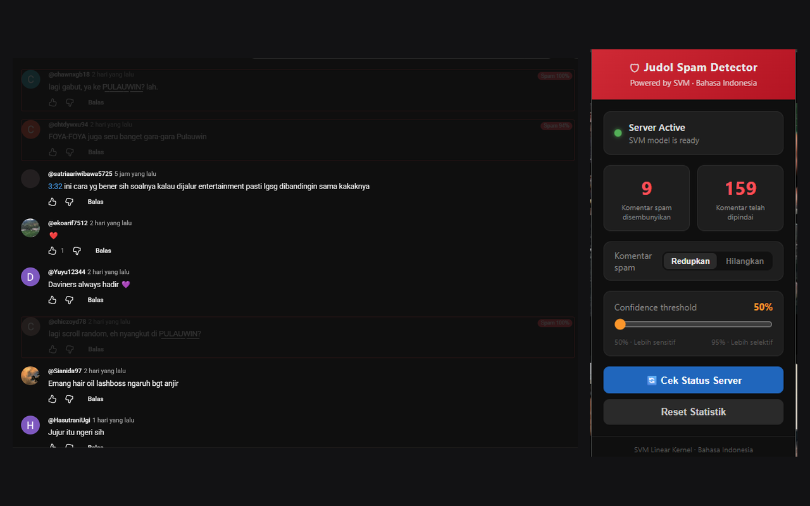

# Judol Spam Detector

Sistem deteksi komentar spam promosi judi online di YouTube. Terdiri dari model
klasifikasi **Support Vector Machine** yang disajikan lewat REST API, dan
ekstensi Chrome yang menyembunyikan komentar spam secara langsung saat pengguna
menggulir halaman.

Dikembangkan sebagai tugas akhir Teknik Informatika.



## Hasil

Model dilatih pada 6.690 komentar berbahasa Indonesia (2.332 spam, 4.358
non-spam) yang dikumpulkan lewat YouTube Data API v3 dan dilabeli manual.

| Metrik | Nilai |
|---|---|
| Akurasi (data uji 1.338 baris) | 97,53% |
| F1-macro | 0,9726 |
| Cross-validation 5-fold | 0,9741 ± 0,0030 |
| Akurasi pada 135 kasus ambigu | 98,52% |

Sebagai pembanding pada dataset yang sama, Logistic Regression mencapai 97,09%
dan Naive Bayes 93,95%.

Dua eksperimen menghasilkan temuan negatif yang tetap dilaporkan: penambahan
aturan heuristik di atas SVM justru menurunkan akurasi 7,32 poin, dan stemming
Sastrawi tidak memberi perbedaan yang signifikan secara statistik (p = 0,3575).
Keduanya dijelaskan di [docs/eksperimen.md](docs/eksperimen.md).

## Arsitektur

Tiga komponen yang berjalan terpisah:

```
YouTube Data API v3
        |
        v
scraper/index.js          pengumpulan komentar + penyaringan awal
        |
        v
src/prepare_dataset.py    pelabelan, hasilnya data/comments.csv
        |
        v
src/train.py              pelatihan, hasilnya model/svm_model.joblib
        |
        v
src/server.py             REST API (FastAPI)
        ^
        | HTTP
        |
extension/content.js      ekstensi Chrome di halaman YouTube
```

Scraper dan pelatihan dijalankan manual sesekali. Yang berjalan terus-menerus
hanya server dan ekstensi.

Ekstensi mengirim teks komentar apa adanya, tanpa pembersihan di sisi
JavaScript. Seluruh normalisasi dilakukan oleh satu modul Python yang dipakai
bersama oleh pelatihan dan prediksi, supaya keduanya menerima masukan dalam
bentuk yang persis sama. Alasan lengkapnya ada di
[docs/arsitektur.md](docs/arsitektur.md).

## Menjalankan secara lokal

```bash
python -m venv env
source env/Scripts/activate      # Linux/macOS: source env/bin/activate
pip install -r requirements.txt
python src/server.py
```

Server berjalan di `http://localhost:8000`. Dokumentasi interaktif tersedia di
`http://localhost:8000/docs`.

Untuk memasang ekstensinya, buka `chrome://extensions`, aktifkan Developer
mode, lalu "Load unpacked" dan pilih folder `extension/`.

Langkah lengkap termasuk cara melatih ulang model ada di
[docs/instalasi.md](docs/instalasi.md).

## Struktur repositori

| Folder | Isi |
|---|---|
| `src/` | Preprocessing, pelatihan, server, dan skrip eksperimen |
| `extension/` | Ekstensi Chrome (Manifest V3) |
| `scraper/` | Pengumpul komentar berbasis Node.js |
| `data/` | Dataset berlabel dan koreksi manual |
| `model/` | Model produksi dan arsip versi sebelumnya |
| `reports/` | Grafik dan keluaran evaluasi |
| `diagram/` | Sumber diagram (draw.io) |
| `deploy/` | Konfigurasi systemd dan Nginx |
| `docs/` | Dokumentasi |

## Dokumentasi

Seluruh dokumentasi ada di [docs/](docs/README.md).

Yang paling sering dibutuhkan:

- [Instalasi dan cara menjalankan](docs/instalasi.md)
- [Arsitektur sistem](docs/arsitektur.md)
- [Dataset dan cara pengumpulannya](docs/dataset.md)
- [Model dan pelatihan](docs/model.md)
- [Hasil evaluasi](docs/evaluasi.md)
- [Referensi API](docs/api.md)

## Batasan

- Hanya mendukung YouTube. Platform lain belum diuji.
- Model dilatih pada komentar berbahasa Indonesia.
- Nama situs judi yang belum pernah muncul di data latih bisa lolos, terutama
  jika polanya tidak mengikuti akhiran numerik yang umum. Dibahas di
  [docs/evaluasi.md](docs/evaluasi.md#keterbatasan).
- Prediksi membutuhkan server. Ekstensi tidak bisa bekerja offline.

## Lisensi

[MIT](LICENSE)
